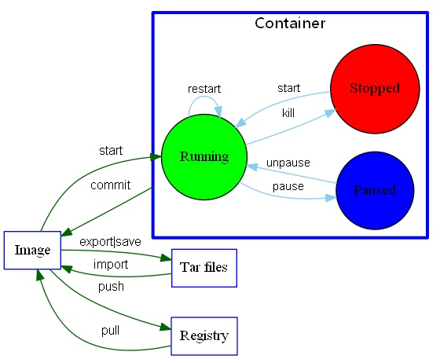

title: docker学习总结 
date: 2016-02-29
tags: docker
---

## 前言
学习docker有一周了，学习主要看华为写的《Docker进阶与实践》，还有[yeasy](https://github.com/yeasy/docker_practice) 的《Docker 从入门到实践》，期间还参考了不少官网的内容，对于，docker现在应该算是入门了，起码基本的使用现在是没什么问题了。从上一年开始关注docker，到今天入门了，终于填好了一个坑，特别写篇笔记，记录自己学docker的心得。

<!--more-->
## 命令

从yeasy的书里，搞了一张图出来，这张图，可以算得上docker的cheatsheet了。
其实docker的命令也没啥好说的，也就十几个，常用常熟，也不需要特别记忆了。



## 搭建私人docker registry

用docker官方的registry来搭建自己的镜像服务器是最省事的了

```bash
//latest 那个tag在使用的时候会打印api过期，直接用v2的版本吧
docker pull registry:2.3.0

//创建一个本地目录来放上传的镜像
mkdir /registry
docker run -p 5000:5000 -v /registry:/var/lib/registry -d --name local_registry registry:2.3.0

//用curl验证镜像是否正常(具体ip看机子，如果是用docker-machine，可以用docker-machine ip default(你创建的虚拟机名字))
curl -i 192.168.99.100:5000
```

看到返回了200，说明镜像正常工作

```
HTTP/1.1 200 OK
Cache-Control: no-cache
Date: Tue, 01 Mar 2016 13:10:22 GMT
Content-Length: 0
Content-Type: text/plain; charset=utf-8
```

接下来就是尝试使用自己搭建的镜像了！

```
//注意namesapce 要用你的镜像ip
docker tag busybox 192.168.99.100:5000/local_busybox

docker push 192.168.99.100:5000/local_busybox 
```

然后你会发现push失败了

>he push refers to a repository [192.168.99.100:5000/local_busybox]
unable to ping registry endpoint https://192.168.99.100:5000/v0/
v2 ping attempt failed with error: Get https://192.168.99.100:5000/v2/: tls: oversized record received with length 20527
 v1 ping attempt failed with error: Get https://192.168.99.100:5000/v1/_ping: tls: oversized record received with length 20527
 
 发生这个的原因，是docker默认是用https，配ssl是一个麻烦的事情，如果你是打算像我这样本地用来测试的，可以让docker使用http来push，但是，如果是公网的，无论多麻烦都不要省这个事情！
 
 ```
 docker-machine ssh default
 
 //进到我们的docker虚拟机后修改
 
 sudo vi /var/lib/boot2docker/profile
 
 EXTRA_ARGS='               
--label provider=virtualbox             
--insecure-registry 192.168.99.100:5000                                               
' 
//然后重启docker-machine
docker-machine restart default
 ```
 
 当你把镜像重新运行起来就可以正常使用
 ```
 docker push 192.168.99.100:5000/local_busybox 
 ```
 
 这次就不会报错了！

### 参考资料
> https://docs.docker.com/registry/deploying/

## 完整的docker实践

index.js

>```js
var http = require('http')
var PORT=10000;
var server = http.createServer(function (request, response){
  response.end("Hello World! " + request.url)
})
server.listen(PORT, function(){
  console.log("Server listening on: http://localhost:%s", PORT);
})
```

Dockerfile

>```Dockerfile
FROM node:4.3.1
ADD . /code
WORKDIR /code
CMD node index.js
```

接下来使用

```
docker build -t firstnode .
```

### Docker Compose

我们一个项目通常会用到多个不同的应用，例如连接数据库，根据docker的官方的建议，一个容器最好只运行一个进程的原则，所以，单单一个dockerfile是满足不了这个需求的，于是官方推出了docker-compose 用于构建多容器。

>对于如何安装docker-compose 请参考官网教程 https://docs.docker.com/compose/

使用也是很简单只要在项目目录上创建一个`docker-compose.yml`的文件即可

```Dockerfile
version: '1'
services:
//这个是我们上面创建的image的名字
  firstnode:
    build: .
    ports: 
     - "10000:10000"
    volumes:
     - .:/code
    depends_on:
     - redis
 //注意！连接redis的时候host部分要填写与这里一致的名字
  redis:
    image: redis
```

然后运行
```
docker-compose up
```

## ARM 上的docker

http://blog.hypriot.com/

## 常见问题合集

### -v 映射的目录必须是绝对路径
例如，你当前路径有一个叫做registry，想这样映射目录是不起作用 的！
>docker run -p 5000:5000 -v registry:/var/lib/registry -d --name local_registry registry:2.3.0

