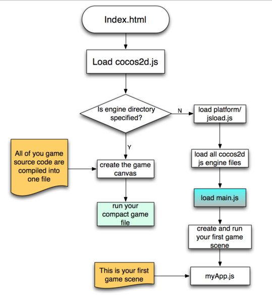

title: "Let's start Cocos2d-html5 1 : Hello World!"
date: 2014-02-08
tags: game
---

## 世界观

组成 cocos2d-html5的世界基石大体分为3类

* Scene
* Layer
* Sprite

关于这部分的详细讨论我们留到后边吧,如果你等不及了,可以去翻阅官方文档 [here](http://cocos2d-x.org/wiki/Director_Scene_Layer_and_Sprite)
<!--more-->
## 开天辟地

这个项目下载地址: [https://github.com/youxiachai/Cocos2d-html5-little-book/tree/master/myhelloWorld](https://github.com/youxiachai/Cocos2d-html5-little-book/tree/master/myhelloWorld)

* 项目目录结构

总共才4个文件

```bash
│   boot-html5.js
│   index.html
│   main.js
│
└───src
        HelloScence.js
```

* `index.html` 我的世界
要创建一个cocos2d-html5 的世界,我们只需要创建一个`canvas`和 一个`script` 即可.
```html
<canvas id="gameCanvas" width="1280" height="720"></canvas>
<script src="boot-html5.js"></script>
```

* `boot-html5.js`


上帝说要有光,我们就得把光造出来,而这个文件就是用于如何让引入 cocos2d-html5 最基本的世界元素

```js
(function () {
    var d = document;

    // cocos2d-html5 配置定义
    var c = {
        COCOS2D_DEBUG:2, //0 to turn debug off, 1 for basic debug, and 2 for full debug
        showFPS:true,
        frameRate:60,
        renderMode:0,       //渲染模式: 0(default), 1(Canvas only), 2(WebGL only)
        tag:'gameCanvas', //世界在那里!
        engineDir:'../cocos2d/',
       // SingleEngineFile:'../../Cocos2d-html5-min.js',
       //引入我们定义的场景js 文件
        appFiles:[
            'src/HelloScence.js'
        ]
    };
    window.addEventListener('DOMContentLoaded', function () {
        //添加引擎js 文件
        var s = d.createElement('script');
        s.src = c.engineDir + 'jsloader.js';
        d.body.appendChild(s);
        //把配置信息加载到document, 用于全局访问
        document.ccConfig = c;
        s.id = 'cocos2d-html5';
    });
})();
```

* `HelloScence.js`

现在,我们开始创建我的世界吧!

```js
var HelloLayer = cc.Layer.extend({
    init :function()
    {
        this._super();
        // 获取当前屏幕信息
        var s = cc.Director.getInstance().getWinSize();

        // 游戏背景层
        var layer1 = cc.LayerColor.create(new cc.Color4B(0, 0, 0, 255), 1280, 720);
        layer1.setAnchorPoint(new cc.Point(0.5,0.5));


        // 文字精灵
        var helloLabel = cc.LabelTTF.create("Hello world", "Arial", 60);
        helloLabel.setPosition(new cc.Point(s.width/2,s.height/2));
        helloLabel.setColor(new cc.Color3B(0,255,0));

        //把精灵添加到背景层
        layer1.addChild(helloLabel);

        // 把合成好的层添加进来
        this.addChild(layer1);

        // 返回我们的HelloLayer
        return this;
    }

});

var HelloScene = cc.Scene.extend({
    onEnter:function(){
        this._super();
        // 把我们的定义好的图层添加到场景里面
        this.addChild(new HelloLayer().init());
    }
})
```

* `main.js`
> 关于为什么是`main.js` 而不是其他,请看附录的加载流程图

```js
var cocos2dApp = cc.Application.extend({
    // 加载配置信息, 这下明白`  document.ccConfig = c;` 的意思了吧
    config:document['ccConfig'],
    ctor:function (scene) {
        this._super();
        this.startScene = scene;
        cc.COCOS2D_DEBUG = this.config['COCOS2D_DEBUG'];
        cc.initDebugSetting();
        cc.setup(this.config['tag']);
        cc.AppController.shareAppController().didFinishLaunchingWithOptions();
    },
    applicationDidFinishLaunching:function () {

        //注意 director 的使用
        var director = cc.Director.getInstance();
        director.setDisplayStats(this.config['showFPS']);
        director.setAnimationInterval(1.0 / this.config['frameRate']);
        director.runWithScene(new this.startScene());

        return true;
    }
});

// 我们的世界就出来了!
var myApp = new cocos2dApp(HelloScene);
```


> ps: firefox 的WEBGL 性能令人发指的烂...chrome 一般能跑满60帧

## 附录

### API 文档

官方在线文档: [http://www.cocos2d-x.org/reference/html5-js/V2.2.2/index.html](http://www.cocos2d-x.org/reference/html5-js/V2.2.2/index.html)

官方文档离线镜像: [https://github.com/youxiachai/cocos2d-html5-api-offlinedoc](https://github.com/youxiachai/cocos2d-html5-api-offlinedoc)

### 文件加载过程

这个图是跑酷教程chapter2 截图



