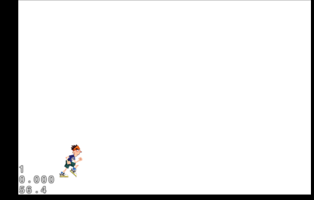
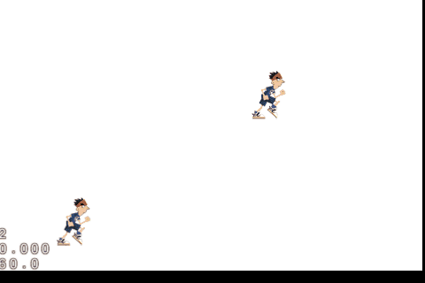
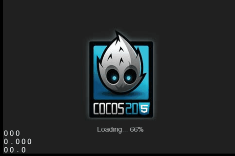

title: Let's start Cocos2d-html5 2 : Dynamic World !
date: 2014-02-09
tags: game
---

## 上节回顾

在上一节中,我们大概了解场景, 层, 精灵 ,接下来我们重点讨论一下精灵的使用.

这次我们的项目比上一节复杂那么一点点.

本节项目目录结构

Github: [https://github.com/youxiachai/Cocos2d-html5-little-book/tree/master/myDynamicWorld](https://github.com/youxiachai/Cocos2d-html5-little-book/tree/master/myDynamicWorld)

```bash
│   boot-html5.js
│   index.html
│   main.js
│
├───res
│       runner.png
│       running.plist
│       running.png
│
└───src
        DynamicWorldScence.js
        resource.js
        StandHumanLayer.js
        WorldElement.js
```

<!--more-->

## 女娲造人

### 泥人材料

女娲要造人,材料当然不可或缺了, 在`cocos2d-html5` 里头,我们一般会约定把图片素材放到项目的`res` 目录下,接下来用吗手工定义一个用于处理资源文件的js,方便我们用于访问.

```js
var ImgRes = ImgRes || {},
    g_resources = [];

ImgRes.s_runner_png = "runner.png";
ImgRes.s_running_png = "running.png";
ImgRes.s_running_plist = "running.plist";

//把需要预加载的资源路径添加进来
Object.keys(ImgRes).forEach(function (item){
    g_resources.push({
        src : ImgRes[item]
    })
})
```
> 有人可能会想,一个个写好的蛋疼啊..有没有自动搞定的方式? 答案是肯定有了! 不过这个不在本节讨论范围内,初学,还是老老实实一个个手动添加资源吧.

这里的资源路径不应该是 `res/runner.png` 吗? 为什么写成了 `runner.png` 是不是搞错了什么呀.这是故意这么写的.

接下来,我们要对上一节的`main.js` 进行一点小改动

将
```js
director.runWithScene(new this.startScene());
```

替换成

```js

// 定义搜索资源的目录, 这里我们约定了res. 这样对于res 目录下的资源我们之间写名字即可.
cc.FileUtils.getInstance().setSearchPaths([].concat("res"));

cc.LoaderScene.preload(g_resources, function () {
            director.replaceScene(new this.startScene());
}, this);
```

因为我们这里有图片素材,当然需要与加载到缓存里面,`cocos2d-html5` 的预加载api 非常贴心,只需要使用 `cc.LoaderScene.preload` api 即可,而`g_resource` 就是我们之前定义好的资源数组.

这样我们的要准备造泥人的材料就准备好了, 接下来开始造人!

**注意对于新增的js文件,千万不要忘记了在`boot-html5.js` 配置定义`appFiles` 数组 里头添加新增js文件路径.**

### 造人

作为`cocos2d-html5` 的女娲,要造一个人非常简单.

```js
var StandHumanLayer = cc.Layer.extend({

  ctor: function (path) {
        this._super();
        var humanSprite = cc.Sprite.create(path);
        //定义我们的人出现的坐标点.
        //值得注意的是在cocos2d-html5 的世界,坐标用的是右手坐标系,起始点在左下,而不是一般的左上.
        humanSprite.setPosition(cc.p(80, 57));

        this.addChild(humanSprite);
  }
});

//---------DynamicWorldScence.js
// 在我们的世界场景里`onEnter` 函数里添加

 this.addChild(new StandHumanLayer(ImgRes.s_runner_png));

```

然后,我们世界第一个人就出来了!



接下来我们的人怎么移动动起来呢?

这里涉及到了

> [Cocos2d-x 的Action 机制](http://www.cocos2d-x.org/wiki/Actions)

默认的基本动作提供了5种

* Position
* Scale
* Rotation
* Visibility
* Opacity
* Color

以平移为例

```js

//让我们在StandHumanLayer.js 的ctor 函数里头再造一个会动的人吧

var humanSprite2 = cc.Sprite.create(path);

humanSprite2.setPosition(cc.p(80, 200));
//在2s 内 X 轴从80 到 300
var actionTo = cc.MoveTo.create(2, cc.p(300, 200));

humanSprite2.runAction(cc.Sequence.create(actionTo));

this.addChild(humanSprite2);
```



### 活起来!

上一小节我们终于把人造好了,也能控制这人怎么移动,不过都是僵硬的,接下来,我们把人造得有人气!

这里涉及到了

> [cocos2d-x Animations 机制](http://www.cocos2d-x.org/wiki/Animations)

`cocos2d-html5` 支持3类动画

* Frame Animation
* Sprite Sheet Animation
* Skeleton Animation

这节里头我们用的是`Sprite Sheet Animation`.

> 本节的plist 的创建请阅读 [https://github.com/cocos2d/cocos-docs/blob/master/tutorial/parkour-game-with-javascript/chapter5/en.md](https://github.com/cocos2d/cocos-docs/blob/master/tutorial/parkour-game-with-javascript/chapter5/en.md) 这里有教你怎么用TexturePackerGUI.

经过一番努力,终于从TexturePackerGUI 把我们的活人表造出来了,接下来就是用起来了.

最终完成的代码:

```js
// 扩展StandHumanLayer.js 的构造函数,传入精灵表信息
var StandHumanLayer = cc.Layer.extend({

    ctor: function (path,origin, originlist) {
        this._super();


        // 1  静态
        var humanSprite = cc.Sprite.create(path);
        humanSprite.setPosition(cc.p(80, 57));

        this.addChild(humanSprite);


        //2  移动
        var humanSprite2 = cc.Sprite.create(path);
        humanSprite2.setPosition(cc.p(80, 200));
        var actionTo = cc.MoveTo.create(2, cc.p(300, 200));
        humanSprite2.runAction(cc.Sequence.create(actionTo));
        this.addChild(humanSprite2);

        //3 会动的人

        this.anime(origin, originlist)

    },
    anime : function (origin, originlist) {
        // 1 读取我们预加载的精灵表
        cc.SpriteFrameCache.getInstance().addSpriteFrames(originlist);
        // 1.1 使用 SpriteBatchNode 获得更好的性能
        var spriteSheet = cc.SpriteBatchNode.create(origin);
        this.addChild(spriteSheet);

        // 2 把精灵表里的每帧动作加载到数组里面
        var animFrames = [];
        for (var i = 0; i < 8; i++) {
            var str = "runner" + i + ".png";
            var frame = cc.SpriteFrameCache.getInstance().getSpriteFrame(str);
            animFrames.push(frame);
        }

        // 3 使用我们上头定义好的数组,创建动画, 第二参数,为每帧间隔时间
        var animation = cc.Animation.create(animFrames, 0.1);
        var runningAction = cc.RepeatForever.create(cc.Animate.create(animation));

        // 4 从我们精灵表里头取第一帧作为精灵
        var sprite = cc.Sprite.createWithSpriteFrameName("runner0.png");
            sprite.setPosition(cc.p(80, 280));
            sprite.runAction(runningAction);

        // 4.1 最后把我们的第一帧精灵加入到精灵表里.
       spriteSheet.addChild(sprite);
    }

})
```

最终效果




## 来源声明

图片资源来至于跑酷教程 [https://github.com/cocos2d/cocos-docs/tree/master/tutorial/parkour-game-with-javascript](https://github.com/cocos2d/cocos-docs/tree/master/tutorial/parkour-game-with-javascript)
