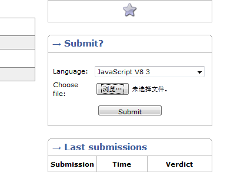
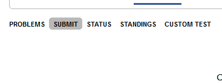
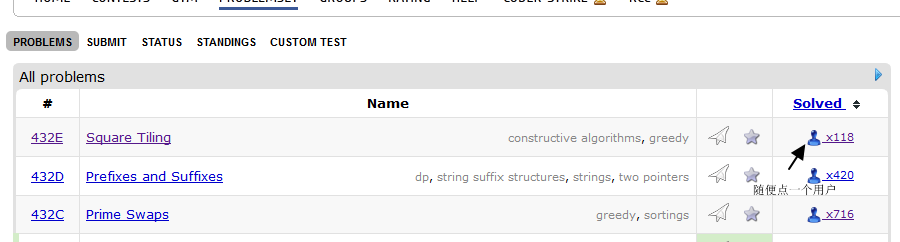
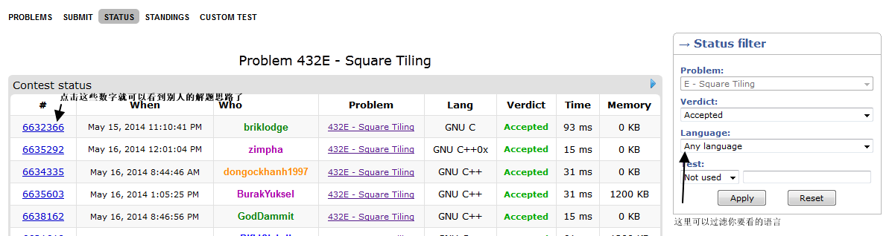

title: JavaScript 也来挑战ACM
date: 2014-05-18
tags: node
---

## 前言

作为一个ACM票友,最近,在微博上看到,有人说现在有支持JS的OJ平台,于是,花了一点时间摸索了一下,为了让更多的js程序员也入坑,于是写一篇快速入门的攻略,让各位用js在ACM圈子里面打出一番天地.....


<!--more-->

## 支持JS的OJ网站

据我所知,目前有两个OJ平台支持用js 做题

1. http://judge.u-aizu.ac.jp/onlinejudge/index.jsp
2. http://codeforces.com/

第一个是日本的OJ平台,是后来有人介绍给我的,我没有怎么认真去看,所以,本篇博文,讲的是如何在第二个毛子的OJ平台用js做题.

## 用JS做题

注册账号什么..看得懂英文的应该都没什么问题,所以,现在让我们直接去做题吧!

找一个水题测试一下,怎么用js来写输入输出

http://codeforces.com/problemset/problem/1/A


```js
function main() {

    var numbers = readline().split(' ');

    var one = numbers[0];

    var two = numbers[1];

    var three = numbers[2];


    print(Math.ceil(one / three) * Math.ceil(two / three));
}

main();
```

在codeforces, 跑js直接用的是v8, 所有输入流用的是`readline()`,输出用`print()` 习惯的话,比用node的简单不少.

## 本地测试

我们写好的js文件,用node来跑肯定不行,在windows平台下,codeforces已经编译好二进制包给我们了,我们只要下载,安装就行

http://assets.codeforces.com/files/v8-3.32.0.7z

对于linux和mac的平台,你们得自己去编译个v8了.接下来以windows平台本地运行为例.

下载好了,我们windows下的运行环境二进制包以后,要运行刚才写的代码我们只需要

```
d8 1a.js
```

简单测试一下,输入,输出,感觉没问题了,我们就开始提交答案吧.

## 提交答案

在问题的右边有个上传文件的框.你直接把js文件上传上去就行了.



那么有没有在线写的呢?答案是有的,就在**sumbit** 这个tab上



接下来等结果就好了.

## 看别人的解决思路

对于一个ACM的票友而言..最痛苦的莫过于,想了半天都搞不懂,想看答案学习一下,但是Oj平台又不让看别人的提交的答案,不过codeforces 没这个限制,所有答案都是公开的.



在接下来的页面,我们可以看到各种语言对于这道题的状态,点击最左边的数字可以看到别人的解题思路代码,右边有个过滤条件tab,可以根据自己需要进行过滤



## 性能

对于js 在做题的时候,性能如何? 官方有个benchmark

http://codeforces.com/blog/entry/10024

就性能而言,肯定没法跟c比,不过,作为ACM业余票友而言(专业的肯定不会用js来写了..),这个性能足以去做不少题了.吐槽一下..ruby 真慢..


