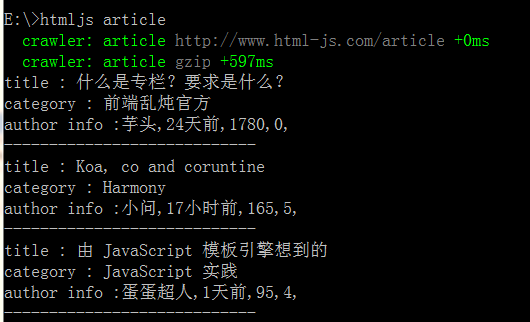
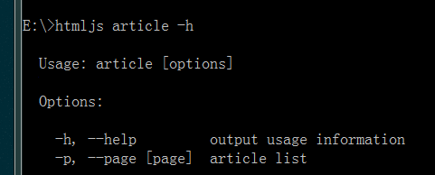

## 前言

每次看到一些库`npm -g install xx`然后,执行`xx`就可以跑起来,这不就是一个shell工具了吗,那么我不就可以不用学习shell语法,直接用js写命令行脚本了吗!

<!--more-->

## 什么是REPL应用

所谓的repl应用就是一个终端命令行工具,如果使用linux对于命令行工具例如curl,awk,grep,find,这些肯定不陌生,而现在,我们就是用node去写类似这样的程序

## 读取-求值-输出

对于第一次动手写repl应用,我们首先,了解一些知识点.

### Process api

>文档 http://nodejs.org/api/process.html

process 对象在node里面是全局对象,不需要用require引入,直接使用

>console.log(process)

我们就可以在终端里面看到process都有些什么内容了.对于,开发一个repl应用,我们对于process对象只需要了解以下下几点就行

*   process.argv //这次输入值集合
*   process.stdout.* //终端输出方法
*   process.stdin.* //终端输入方法
*   process.exit(); // 退出

对于process的了解这几点大部分repl应用都可以开发了,接下来,我们说说,如何让命令行工具读取参数.

### 读取

对于repl而言,值读取的常见的一般有两种:

#### 配置值

```js
#!/usr/bin/env node
if(process.argv[2] === '-w'){
    var args = process.argv.slice(3);
    var output = '';
    args.forEach(function (item){
        output += item + ' ';
    })
    console.log(output);
    process.exit();
}
```
>node repl.js -w Hello world!

>Hello world!

#### 交互式

```js
#!/usr/bin/env node
function read(prompt) {
    process.stdout.write(prompt + ':');
    process.stdin.resume();
    process.stdin.setEncoding('utf-8');
    process.stdin.on('data', function(chunk) {
      process.stdout.write('output: ' + chunk);
      process.exit();
    });
}

read('input')
```

>node repl.js

>input: Hello world!

>output: Hello world!

repl 应用本质其实就是一个shell脚本,现在我们要用node来写,所以,对于*nix环境我们必须在第一行说明我们的文件需要在什么环境下运行.
>`#!/usr/bin/env node`

#### process.argv

我们主要从命令行输入值都是从`process.argv`里面读取,这个对象,保存了我们所有命令行的输入,我们可以打印出来看看

>console.log(`process.argv)
```
[ 'node',
  'E:\\ProjectGitHub\\node.js\\repl.js',
  '-w',
  'Helloworld!' ]
```

从这个输出我们就可以很明了的知道我们为什么要用` process.argv.slice(3);`来获取值了.


#### process.stdout && process.stdin

这两个方法用于对终端输出和输入的操作,上面的例子应该很好演示这个使用了,这里就不再赘述了.


### 求值 & 输出

#### 实战演练

现在要讲的这个repl应用就是简单的在终端中显示前端乱炖的专栏列表.效果如下(PS:绿色那些是debug输出,你自动忽略吧...):

>输入 `htmljs article`

>输入 `htmljs article -p 1`



#### 内容准备

这里用到了`request`,`cheerio` 对前端乱炖页面进行解析,这块的讨论已经超出了本文的讨论范围,以后放在介绍`cheerio`的时候再说这块的实现.

用命令行看前端乱炖专栏列表:

> https://github.com/youxiachai/html-js-cli

#### 利用Commander处理输入

对于如何在终端输入参数,在上面的读取篇已经全部介绍完毕,用原生`process`处理输入异常的繁琐,对于这点,TJ大神写了一个模块`commander`用来处理.

```js
#!/usr/bin/env node

var program = require('commander'),
    htmljscli = require('../index'),
    libInfo = require('../package');

program
    .version(libInfo.version)

program
    .command('article')
    .description('show article list')
    .option('-p, --page [page]', 'article list')
    .action(function(options){
        htmljscli.listArticle(options.page)
    });


program.parse(process.argv); // 这行必须是结尾
```

不到20行代码就可以解决了原本需要各种处理`process.argv` 情况,而且还很贴心了帮我们自动生成help介绍

> htmljs article -h

> 

使用`commander` 我们只需要了解一下几点就可以了

* commander.option()

> 用于将对象值对象化, 例如上文定义的` commander .option('-p, --page [page]', 'article list')`我们输入的时候` -p` 的时候,就可以用`options.page` 获取我们的参数

* commander.command().option().action()

> 用于配置子命令

## 发布


有时候,一些库会要求我们

>npm -g install cnpm

然后很神奇的发现可以

>cnpm install xx

这类的操作,那我们发布的包怎么实现这个神奇的魔法呢.原理非常简单,我们只需要在我们的`package.json`加入以下几句就行

```js
{
  "bin": {
    "htmljs": "./bin/htmljscli"
  }
}
```

用`npm` 安装的时候就会自动与当前系统环境进行绑定.

接下来我们只需要

>npm -g install html-js-cli

运行

>htmljs article

就可以在终端看到专栏列表了


值得注意的时候,在`windows`发布你写node repl应用,`*nix`用户安装的时候,命令并不会起作用,所以,要用`npm`发布repl应用的时候请使用`*nix`系统

## Node repl 应用

### 豆瓣电台命令行版

>[https://github.com/turingou/douban.fm](https://github.com/turingou/douban.fm)

###微博命令行工具

>[http://justan.github.io/twei/](http://justan.github.io/twei)

###cnpmjs

>[https://github.com/cnpm/cnpm](https://github.com/cnpm/cnpm)


