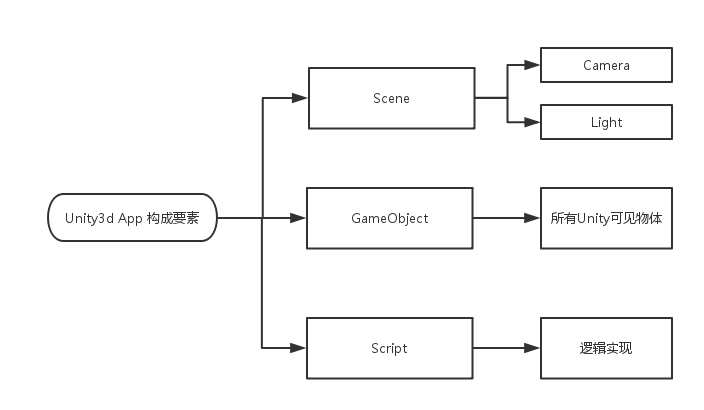

这周，好恨啊，几乎是摸了一个星期的鱼，准时下班，然而，回到家了，就会因为莫名其妙的问题，我也不知道发生了什么事情，就到12点了，然而，我发现什么都没做。

然后周六，周日，也是很神奇的在感觉时间没干什么正事，就过了，感觉再这样下去，我这一辈子堪忧啊。

今年也没几个月过了，剩下的几个月，其实，虽然嘴上说要过得有意义一些，然而，身体却是不受控制的在浪费时间。

好了，unity的入坑虽然过了两周，然而学习时间只有短短的4天，基本的操作和一些UI也算是入门了，做一个简单总结，并且确定往后unity3d学习的知识框架！

<!--more-->

## Unity3d开发流程
	
就我目前学习的unity3d的知识，我知道，要制作一款unity3d app的基本要素如下

1. 场景（Scene）
2. 游戏对象（GameObject）
3. 脚本（Scripts）
	

	
## UGUI的基本使用
摸鱼，摸的太厉害了太晚了，留到下周再补吧。

